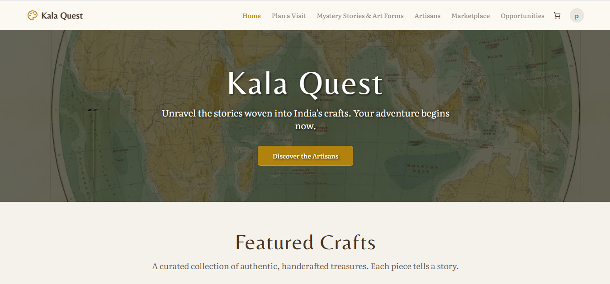
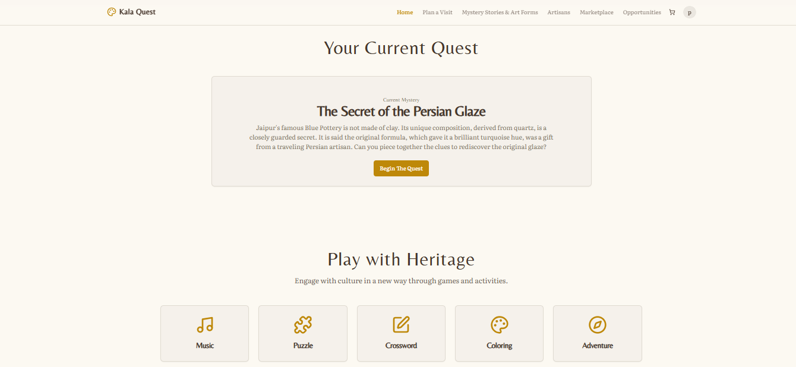
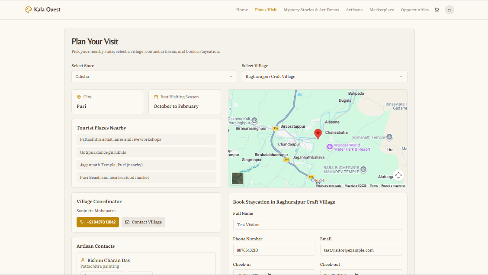
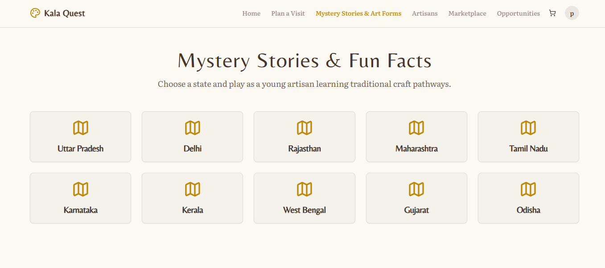
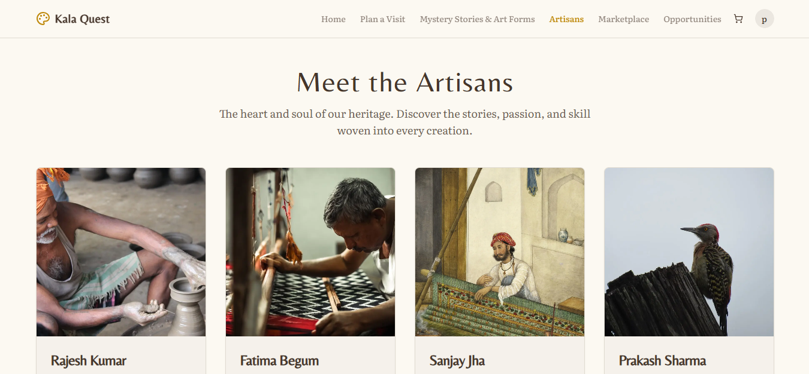
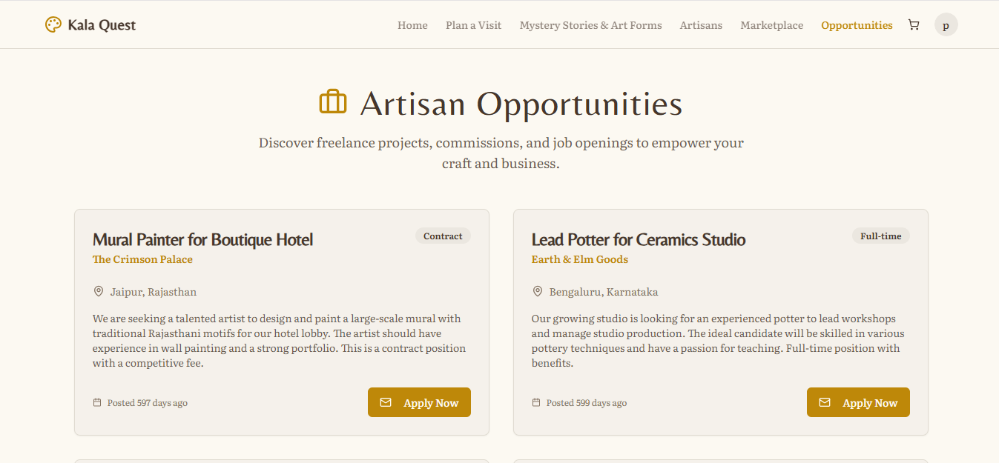

# Kala Quest

**Kala Quest** is an interactive platform that makes Indian heritage engaging through story-based quests, cultural games, and direct connections with artisans—while supporting traditional crafts through a built-in marketplace.

---

## 🌟 Problem

Traditional Indian art and crafts are:
- Hard to discover for younger audiences  
- Not engaging in digital formats  
- Lacking direct connection between users and artisans  

---

## 💡 Solution

Kala Quest transforms cultural learning into an **interactive experience** by combining:
- Story-driven quests  
- Gamified learning  
- AI-powered personalization  
- Direct artisan engagement  

---

## Live Demo
- https://kalaquest-mu.vercel.app

---
## 🚀 Key Features

- 🧩 Story-based mystery quests with collectible clues  
- 🎮 Interactive cultural games (puzzles, simulations, etc.)  
- 🧑‍🎨 Artisan profiles with storytelling + products  
- 🛍️ Integrated marketplace for crafts  
- 🤖 AI chatbot with long-term memory  
- 🧠 Personalized recommendations  

---

## 🔄 Platform Flow

Login -> Dashboard -> Featured Crafts -> Story Quest -> Interactive Play -> Cultural Exploration -> Artisan Profiles -> Marketplace -> Opportunities

---

## Screenshots
### Home Page


### Featured Crafts


### Quest Experience


### Plan A Visit


### Mystery Stories


### Meet the artisans


### Opportunities


--- 

## 🛠️ Tech Stack

### Frontend
- Next.js 15  
- React 19  
- TypeScript  
- Tailwind CSS  

### Backend & Services
- Firebase (Auth + Firestore)  
- Genkit + Google GenAI  

### Tools
- Radix UI / shadcn  
- Vercel  

---

## 👨‍💻 My Contribution

- I created a separate page for the artisans that made the website free friendly to artisans
- I created a one on one chat with the artisan and customer
- I added the ratings section in the marketplace that  helps the customer to give ratings and write reviews so that the legitamcy of website is maintained
- I improved the navigation of the website so that the users to increase the retention period

---

## Getting Started
1. Install dependencies:
```bash
npm install
```
2. Create `.env.local` and set your model key:
```bash
GOOGLE_API_KEY=your_own_google_ai_key
```
3. Start dev server:
```bash
npm run dev
```

The app runs on `http://localhost:9002`.

## API Key Setup (Important)
- Use your own model key in `.env.local`: `GOOGLE_API_KEY` or `GEMINI_API_KEY`.
- Restart the server after changing the key.
- Do not use Firebase `apiKey` (from `src/firebase/config.ts`) for chatbot model calls.

## Chatbot UI
- Open `http://localhost:9002/chatbot`
- The page keeps one `conversationId` per `userId` in browser local storage.
- Signed-in users use Firebase UID automatically.
- Guests can set a custom `userId`.
- `New Conversation` creates a fresh thread ID for that user.

## Chatbot API (`/api/chatbot`)
The backend stores vector memories in Firestore and retrieves relevant memories by cosine similarity.

### `mode: "chat"`
- Required: `userId`, `message`
- Optional: `conversationId`, `topK`, `maxScan`, `historyLimit`, `remember`
- Returns: `answer`, `conversationId`, `relatedMemories`, `storedMemories`

Example:
```bash
curl -X POST http://localhost:9002/api/chatbot \
  -H "Content-Type: application/json" \
  -d '{
    "mode": "chat",
    "userId": "user-123",
    "conversationId": "conv-abc",
    "message": "Plan my weekend based on my preferences"
  }'
```

### `mode: "remember"`
- Required: `userId`, `remember` (`string` or `string[]`)

### `mode: "search"`
- Required: `userId`, `query` (or `message`)
- Optional: `topK`, `maxScan`

### Inline memory
If a chat message starts with `remember ...`, it is auto-stored as memory.

## Scripts
- `npm run dev`
- `npm run build`
- `npm run start`
- `npm run lint`
- `npm run typecheck`
- `npm run genkit:dev`
- `npm run genkit:watch`

## Project Structure
- `src/app` - Next.js App Router pages and API routes
- `src/components` - shared UI components
- `src/firebase` - Firebase configuration and helpers
- `src/ai` - Genkit setup, chatbot logic, vector memory
- `docs` - product blueprint and backend notes

## Contributors:
This project was developed as a group project by:
- Mousumi Parida
- Poorvajaa S
